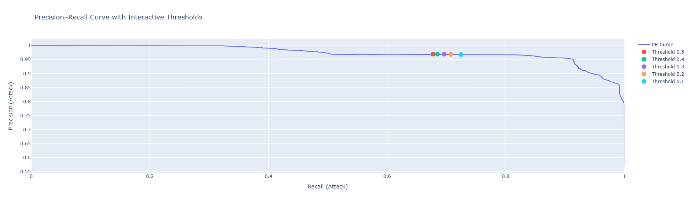

# 🔐 Network Intrusion Detection System using XGBoost

## 📌 Overview
This project implements a **Network Intrusion Detection System (NIDS)** using **XGBoost** on the **NSL-KDD dataset**. The objective is to detect malicious network traffic while minimizing **missed attacks (false negatives)**—a critical requirement in real-world cybersecurity systems.

Instead of relying on accuracy alone, this project emphasizes **realistic evaluation**, **threshold tuning**, and **Precision–Recall analysis** to select an appropriate operating point for deployment.

---

## 🚨 Problem Statement
Given network connection features, classify traffic as:
- **Normal**
- **Intrusion (Attack)**

### Key Challenges
- Class imbalance
- Distribution shift between training and test data
- Unseen attack types in the test set
- Accuracy being misleading for intrusion detection

---

## 🧠 Methodology

### 1️⃣ Data Preparation
- Dataset: **NSL-KDD**
- Training: `KDDTrain+.txt`
- Testing: `KDDTest+.txt`
- Consistent categorical encoding across train and test sets

### 2️⃣ Model Training
- Algorithm: **XGBoost (XGBClassifier)**
- Objective: Binary classification (Normal vs Attack)
- Cost-sensitive learning using `scale_pos_weight`

### 3️⃣ Evaluation Strategy
- Tested strictly on **unseen attack data**
- Metrics used:
  - Precision
  - Recall (Attack class prioritized)
  - F1-score
  - Confusion Matrix

### 4️⃣ Threshold Tuning
- Used predicted probabilities instead of default 0.5 threshold
- Evaluated multiple thresholds
- Selected optimal operating point using **Precision–Recall curve**

---

## 📊 Results
- ~80% accuracy on `KDDTest+` (unseen data)
- Attack recall improved from **~0.68 → ~0.72** via threshold tuning
- Maintained **~0.97 precision**, limiting false alarms
- Demonstrated that **threshold selection** is more impactful than further model tuning

---

## 📈 Visual Analysis

### Precision–Recall Curve (Threshold Selection)
The Precision–Recall curve was used to visualize the trade-off between detecting more attacks and generating false alarms. Thresholds were interactively inspected to choose an operating point suitable for intrusion detection.



**Figure:** Precision–Recall curve with highlighted decision thresholds. Lower thresholds increase recall while slightly reducing precision.

---

### Confusion Matrix (Final Threshold)
The confusion matrix below shows the model’s performance at the selected threshold, highlighting the reduction in false negatives compared to the default threshold.


---

## 🛠 Technology Stack
- Python
- XGBoost
- Scikit-learn
- Pandas, NumPy
- Matplotlib, Seaborn
- Plotly (interactive visualization)
- Google Colab

---

## 📁 Repository Structure
```
network-intrusion-detection-xgboost/
│
├── Notebook/
│   └── Network_Intrusion_Detection_XGBoost.ipynb
│
├── images/
│   ├── pr_curve_thresholds.png
│   └── confusion_matrix.png
│
├── requirements.txt
└── README.md
```

---

## 🚀 Future Work
- Multi-class intrusion detection (DoS, Probe, R2L, U2R)
- Feature importance analysis (SHAP)
- Real-time network traffic integration
- Deployment as a Streamlit or Dash application

---

## 👤 Author
**Anish Sharma**

---

## 📄 License
This project is intended for educational and research purposes.

